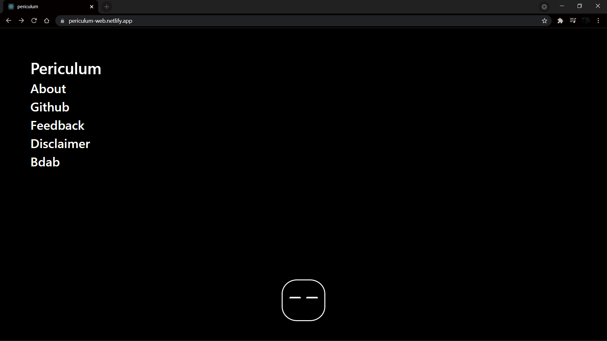
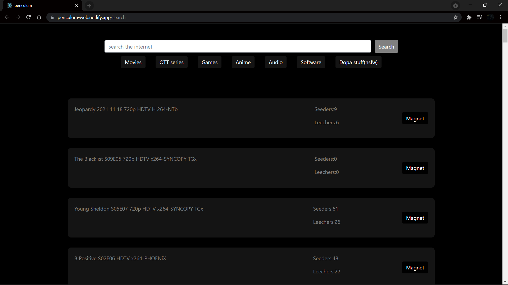

# Periculum - A torrent search engine

## Disclaimer
### NOTE: This is just for educational purposes
  * Periculum is an aggregator and a Multisearch. This means we just search other search engines.
  * Periculum is a very powerful internet location search tool.
  * Periculum does not host or "make available" any files or torrents in any way, shape or form.
  * Periculum links to other independent search engines that might host torrent files. We have       absolutely no control over those domains.
  * Indexing process is completely automated. We don't check it. Whatever the Scraper finds, are sucked in. The good, the bad and the ugly.
  * Periculum files are simply metadata and cannot be copyrighted.

## About
This was made as an effort to reduce scams because we all know Torrent websites are filled with multiple trackers which are continuously logging your information.

The torrent data is collected by an scraper API , which will be open sourced later , that API parse data from sites like katcr.to and 1337x. 

